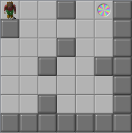
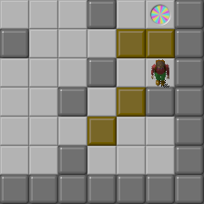
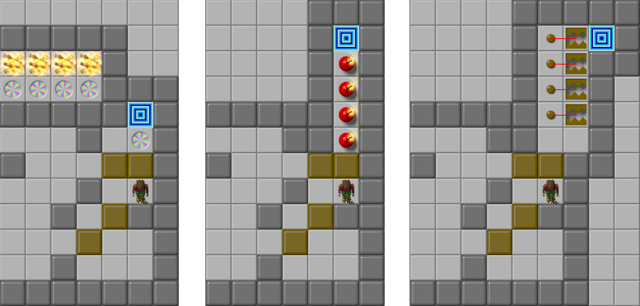

What is this?
=============

Root Beer Generator, aka `rbg`, aka The Notorious R.B.G., is a generator for sokoban-like puzzles.

Given an input level, RBG finds the hardest places to put blocks such that the level is still solvable.
It was designed for "extraction"-type levels, where the goal is to push all the blocks out of a room.
It works by running a level backwards, pulling blocks from the goal to the starting positions,
meaning it only ever considers valid (solvable) game states.

Unlike other sokoban generators, RBG cannot place walls or other puzzle elements for you.
Designing good levels requires a certain amount of aesthetic judgement;
it is difficult to transfer that knowledge into a computer program.
The program could place elements randomly, but that would be unlikely to lead to interesting levels.
On the other hand, testing all possible ways of placing blocks is hard to do for a human but relatively easy to write an algorithm for.

RBG finds the <dfn>longest shortest path</dfn> in the state space.
The <dfn>shortest path</dfn> from any state to the goal state is the optimal solution for that state.
By finding the longest such path, we attempt to maximize the difficulty of the level.
(Solution length is not a perfect proxy for difficulty, but it works well enough.)

Doing this requires exhaustively exploring (and remembering!) the entire state space of the level;
as such, the primary bottleneck is memory usage.
With 2GB of memory, the upper limit is a few million states.
The details depend on the level, but typically levels of size 8x8 or so (6x6 with popup walls) are computationally tractable to solve.
The search takes up to a minute and the produces a solution of around 100 pushes (fewer for smaller levels, obviously).

The metric RBG uses for solution length is the number of *pushes*, not the number of moves by the player.
There are a couple reasons for this.
First, it decreases the size of the state space by allowing us to ignore time spent moving between blocks.
Second, subjectively, it seems to produce more interesting levels.
(Some branches (see **Other tiles**) use the <dfn>box lines</dfn> metric, which
counts pushing one block multiple times in a straight line as a single push.)

As already mentioned, RBG generates "extraction"-type levels, where the goal is to push all the blocks out of a room.
it cannot yet generate traditional sokoban levels, where the goal is to push all the blocks onto designated squares.
(Support may be added in the future.)

RBG was designed with Chip's Challenge in mind, although it could probably be adapted to other games.
It can read input levels in [CCL format][] and write output in CCL format as well.

[CCL format]: https://wiki.bitbusters.club/CCL

Usage & Installation
----

RBG is written in Go. You will need a [Go compiler][] in order to build it.
It has no other dependencies.

[Go compiler]: https://golang.org/dl/

1. Clone this repository

        git clone https://github.com/magical/rootbeer ./rootbeer
        cd rootbeer

2. Build/run the code

        go build -o rbg .
        ./rbg -map input.ccl -o output.ccl -progress

   _- or -_

        go run . -map input.ccl -o output.ccl -progress

See the **Usage (example)** section for an in-depth example.

### Flags/options: ###

The `-map` flag is required and specifies the layout of the level.
See the **Input format** section for details.

The `-o` flag is optional; if given, the generated level will be written to the given file when the search finishes.

The `-progress` flag causes RBG to periodically log messages showing the progress of the search.

> 2015/10/21 19:28:00 alloc: current 682 MB, max 783 MB, sys 764 MB
> 2015/10/21 19:28:00 search: current 42, max 42, visited: 1959159, queue 814745

The `alloc` line tells you how much memory is currently allocated from the system (sys), how much we are using (cur), and the cumulative total we have ever allocated (max). Units are SI.
The `search` line tells you the length of the longest path found so far (max), the length of the path to the state we are currently visiting (cur, always the same as max), the total number of states visited so far (visited), and the number of states waiting to be visited (queue). The search does not stop until the queue is empty.

Usage (example)
----

Here's an example 6x6 level. It contains some walls, the player, and a teleport.

The player isn't required — if there is no player, one will be added automatically.
The teleport is important — it defines the goal, the point where the player will have to push all the blocks.
It can be anywhere in the level, but is usually somewhere off to the side.

Let's run it through RBG:

    go run . -map example1.ccl -o example1_output.ccl -progress

Here's what it comes up with (`example1_output.ccl`):

Note: this level isn't directly playable yet. It needs an exit and some other stuff.
We'll do that later.

The program also prints some output when it runs.
It starts off by simply showing the input level in a simple textual format.
This allows us to verify that it read the level correctly and that no tiles were cut off
(as would happen if they were outside the defined level bounds).

    2020/10/08 21:39:50
    . . . ##$ []##. .
    ## , , , , ,## , ,
    . . . ##. . ##. .
     , ,## , ,#### , ,
    . . . . . . ##. .
     , ,## , , ,## , ,
    ##############. .
     , , , , , , , , ,

The player is represented by the `$` character, walls are `##`, and blocks are `[]`.
There is initially one block at the goal (teleport) position.

If you used the `-progress` flag, there will be some additional output while RBG runs.
Otherwise it will be silent.

When RBG is finished, it prints out the generated level, the solution, and some extra information.

    2020/10/08 21:39:50 visited 1122 states
    39
    {2 5}
    . . . ##. []##. .
    ## , , ,[][]## , ,
    . . . ##. $ ##. .
     , ,## ,[]#### , ,
    . . . []. . ##. .
     , ,## , , ,## , ,
    ##############. .
     , , , , , , , , ,
    -
    [solution omitted]
    -
    found 3 solutions of length 39

The first line is the number of unique states visited during the search —
not super important but it might be interesting.
The next line is the length of the optimal solution, followed the player's starting coordinates,
followed by a textual representation of the final state (the starting block configuration).
The only difference from the initial state is that there are more blocks (`[]`) and the player is in a different place.
After this, it prints the state at each step in the solution (omitted here).
Lastly, it prints the length of the optimal solution again and the number of paths it found of that length.

In this case, RBG visited 1122 states and found 3 that were 39 moves away from the input state.
That is, it found 3 ways to place the blocks (and player) such that the optimal solution requires 39 pushes.
One of these ways is shown, along with its solution.

Sometimes there is a unique maximal path, but sometimes (as illustrated here) there are multiple maximal paths —
different ways to place the starting blocks that, nevertheless, happen to have solutions of the same length.
RBG only shows one of these (arbitrarily, the first one it happens to find).
It would be possible to show the other paths too, but there is currently no user-configurable way to do so.

Note: this number is *not* the number of solutions for the generated level.
There may be many valid variations on the solution that RBG shows.
RBG makes no attempt to track all the possible variations of a solution.
The only thing we promise is that there is no shorter solution.

Okay. As mentioned above, the level isn't directly playable yet;
we have to add an exit and somewhere for the blocks to go.
Let's do that now.

The usual approach for these types of levels is to add a row of teleports to fire for the blocks to fill up.
But you can also use water or bombs in a more typical CC style,
or take the traditional sokoban approach of an alcove full of brown buttons.

Here are a few examples of finished levels:

Input format
-----

The input format is [CCL][CCL format].
[CCEdit][] is a good level editor.

C2M support may be added in the future.

* The input file must contain only a single level
* Your tiles should be in the upper left corner of the level
    * Walls are implied at the edges of the level
        * But note that RBG's level size does not cover the whole 32x32 area in a CCL
        * The default size is 10×8 (10 columns, 8 rows), though this is somewhat configurable (see **Changing the level size**)
    * Walls are not necessary along the left and top sides of the level. You can add them anyway but they diminish the usable area.
    * Walls *may* not be necessary along the bottom and right sides of the level if your level is right at RBG's level size limit, but you might want to add them anyway in case RBG is configured with a larger level size than you thought.
    * Any tiles outside of the upper left corner are ignored
* Valid tiles are: floor, wall, player, teleport.
    * player isn't required; if there is no player, a starting point will be chosen automatically.
    * teleport defines the goal point, where all the blocks have to go. It can be anywhere in the level area, but is usually somewhere off to the side.
      Multiple goals are not supported.
    * invalid/unknown tiles are ignored
* Other tiles (see **Other tiles** section)
    * water - treated as turtles in the `turtles` branch
    * green button - treated as a gray button in the `gray` branch

[CCEdit]: http://cctools.zrax.net/

Changing the level size
-----------------------

Level size directly impacts memory usage, so it is a compile-time constant, not configurable at runtime.
You can change it, but you will have to recompile RBG after you do (`go build` or `go run`).

The default size is 10×8. The size constants are defined at the top of [bitmap.go](bitmap.go):

    const width = 10
    const height = 8

The most important knob is height: increasing it increases RBG's memory consumption; conversely, decreasing it lowers memory consumption.
The latter can be useful if you are running into memory limits. The maximum height is 255, theoretically, though you are likely to run out of memory well before that.

Width is less important; changing it doesn't affect memory usage. The maximum width is 16.

Both width and height affect the cropping when loading, saving, and printing levels.
The also affect the implicit border around the level.

> TODO: should probably just say the max is 16×16

The Zen of RBG
--------------

> TODO

Other tiles
-----------

Support for other puzzle elements is in various branches of the project.
This was done a) to make it easy to experiment, b) because some puzzle elements are incompatible with each other,
and c) because dealing with interations between elements would add significant complexity in some cases.
Some of these branches will probably be merged into the main branch in the future.

You can change branches with `git checkout`.

* `thin` - Thin walls. Note: doesn't support [flicking][].

* `traps` - Single brown button and trap. Things cannot leave the trap unless the button is held down.
    Targets MS rules (does not support [trap ejection][]).

* `toggle` - Green toggle walls. The green button flips all toggle walls to toggle floors and vice versa.
    Only supports a single button, and does not account for pushing a block onto that button;
    place the button in a corner where blocks cannot get to it.
    Targets Lynx/CC2 rules (doesn't support [flicking][], blocks may start on top of toggle walls).

* `gray` - Gray buttons and toggle walls. Gray buttons flip toggle walls in a 5x5 area around them when stepped on.
    Multiple buttons are allowed, and pushing blocks over buttons is accounted for.
    Targets CC2 rules.

* `turtles` - Popup walls, turtles, and dirt. Popup walls can only be stepped on once.
    Turtles are like popup walls except you can also push blocks onto them.
    Dirt blocks blocks until cleared away by the player.
    Note: does not account for [block slapping][], which may open up shorter solutions.

* `fire` - Fire with [block slapping][]. Targets CC2 rules.

[flicking]: https://wiki.bitbusters.club/Flick
[block slapping]: https://wiki.bitbusters.club/Block_slapping
[trap ejection]: https://wiki.bitbusters.club/Trap#Trap_mechanics_in_Lynx

License
-------

RBG is open source software. You can use it, modify it, and share it under the
terms of the GNU Affero General Public License, version 3.0.

No warranty, etc.

See [LICENSE](LICENSE) for details.

Thanks to...
-----

- The [Bit Busters Club][BBC], for providing encouragement and playtesting
- pieguy, for creating [computer.dat][] and dropping some hints in chat about how his program worked

[BBC]: https://bitbusters.club/
[computer.dat]: http://davidstolp.com/old/chips/overall.php?set=computer
